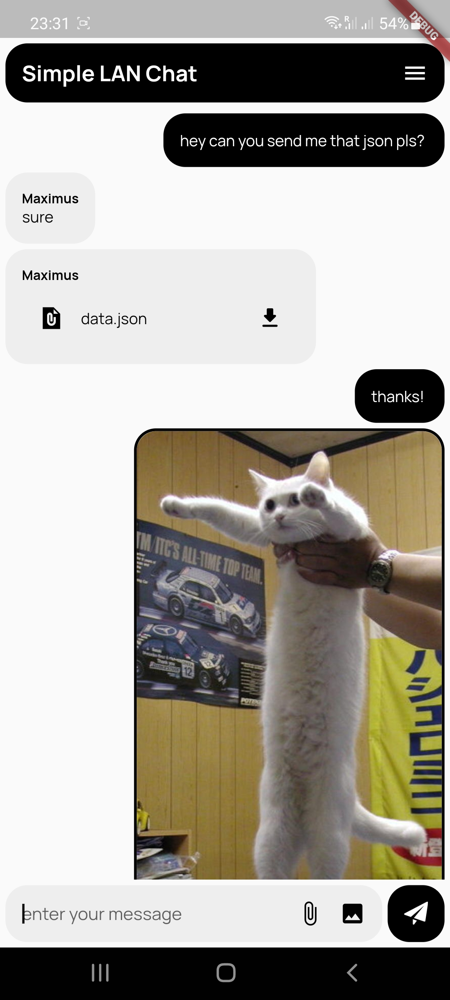
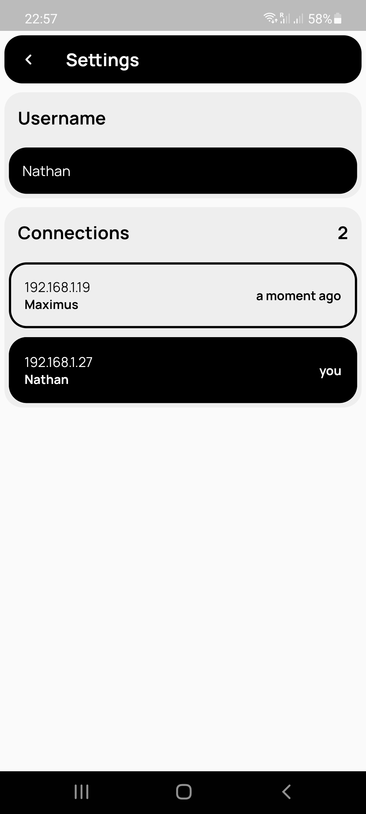

</img> 
# Simple LAN Chat
 

This lightweight local network chat app uses TCP/UDP packets, supporting text, image file sharing, client discovery, and a clean UI.

  <table>
    <tr>
      <td style="text-align: center">
        
      </td>
      <td style="text-align: center">
        
      </td>
      <td style="text-align: center">
        
      </td>
    </tr>
  </table>

LAN Chat is a server-less local network chat app using TCP/UDP packets, supporting text, image, file sharing, client discovery, and a clean UI. You can find it on Google Play, sitting at over 5000 installs. It was built using a handcrafted LAN framework for heartbeat recognition, custom names, and text messages in local packets.

This app is one of the first personal projects I have worked on, and it was initially meant to allow me to quickly share data on the network, from my phone to my PC, for example. Implementing new knowledge about local networks into an app was also fun.

The project is open source and can be directly downloaded to your Android device through Google Play. Documentation on how it was built and figured out to include functionality such as file sharing and network detection can be found on GitHub.

## Functionality
The app requires a WiFi connection and will allow two or more people connected to the same network to chat simply.

It opens a UDP socket, listens to all data on port 1050 and sends a UDP broadcast to communicate. From v1.2, it also supports image sharing. It can be used to have a little fun or quickly share links/images.

# Features
- Instant text messages
- Link sharing
- Images and file sharing (with some limitations)
- Set username to show in addition to the ip address
- No setup required

# Documentation
The app opens sockets on port **1050** for all data including messages and heartbeats.
Each type of message packet starts with a special identifier so that the app knows what to display.

Type      | First Byte
----------|----------------
Heartbeat | 0
Text      | 1
File      | 2

## Text messages
Text messages are broadcasted through UDP packets to the whole LAN therefore anybody can listen to them. 
All text message packets follow the next format:

0 |[...]
--|--------
1 | message

Where **message** is the message itself as a byte array.

## File messages
Files are sent only to sockets recognized as Simple LAN Chat sockets. File messages are different as most of the files are bigger in size than the maximum packet size. 
To solve this issue, messages larger than **50000 bytes** are chopped in parts and sent one by one.

All file messages packets follow the next format:

0   | 1           | 2          | 3           | [...] | [...]
----|-------------|------------|-------------|-------|-------
2   | name length | file index | file size   | name  | message

Where,

- **name length** is the size of the file name (eg. "abc.jpg" has name length of **7**)
- **file index** current index of the file chop, starting at 1 (eg. "abc.jpg" file is too large and was sent as 2 chops, the **second chop** will have file index **2**)
- **file size** how many chops is the file composed of (eg. "abc.jpg" is 90kb therefore it will chopped in half, having a file size of **2**)
- **name** the name of the file as byte array (eg. "abc.jpg")
- **message** the file data as byte array

## Heartbeats
You can see anyone's IP and nickname connected in the app.
Discovery of other connected devices is done on port 1050 through heartbeats. Each client broadcasts a specific message to keep the connection alive.

All heartbeats have the following format:

0 | [...]
--|---------
0 | username

## Own address recognition

To recognise our own local IP address, we are sending a message of the following format at the initialization of the LAN Chat:

0 | 1 .. 10
--|---------
4 | identifier

Where **identifier** is a random byte from 0 to 100.
